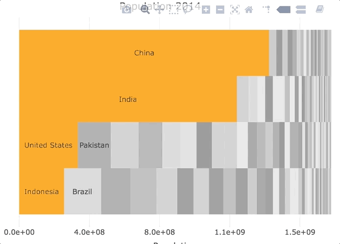
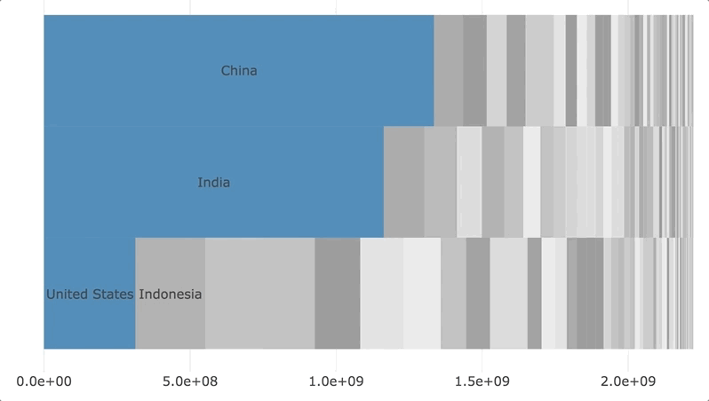

# rPackedBar
Packed Bar Charts in R with Plotly ([Introducing Packed Bars](https://community.jmp.com/t5/JMP-Blog/Introducing-packed-bars-a-new-chart-form/ba-p/39972))

This small package is an adaptation of the packed bar chart introduced by [XanGregg](https://twitter.com/xangregg) in a [JMP User Community Post](https://community.jmp.com/t5/JMP-Blog/Introducing-packed-bars-a-new-chart-form/ba-p/39972) ([XanGregg's packed bar git repo](https://github.com/xangregg/packedbars)).  The package currently consists of only 1 function to make a packed bar chart using [plotly](https://cran.r-project.org/package=plotly).

*Note: The package does not have written tests (nor extensive testing); this was a quick tinkering experiment for fun.  If there is interest I can spend time to improve the code quality.*

## Output

## Usage

    #install package from github
    devtools::install_github("AdamSpannbauer/rPackedBar")

    #use sample data from treemap package
    data(GNI2014, package = 'treemap')
    data.table::setDT(GNI2014)

    #inspect raw data
    head(GNI2014)
    #    iso3          country     continent population    GNI
    # 1:  BMU          Bermuda North America      67837 106140
    # 2:  NOR           Norway        Europe    4676305 103630
    # 3:  QAT            Qatar          Asia     833285  92200
    # 4:  CHE      Switzerland        Europe    7604467  88120
    # 5:  MAC Macao SAR, China          Asia     559846  76270
    # 6:  LUX       Luxembourg        Europe     491775  75990

    #summarize data to plot
    my_input_data = GNI2014[,sum(population), by=country]
    #inspect data to plot
    head(my_input_data)
    #             country      V1
    # 1:          Bermuda   67837
    # 2:           Norway 4676305
    # 3:            Qatar  833285
    # 4:      Switzerland 7604467
    # 5: Macao SAR, China  559846
    # 6:       Luxembourg  491775

    #packed bar with default settings
    plotly_packed_bar(my_input_data,
                      label_column = 'country',
                      value_column = 'V1')
                      

    #customized packed bar
    plotly_packed_bar(my_input_data,
                      label_column    = 'country',
                      value_column    = 'V1',
                      number_rows     = 4,
                      plot_title      = 'Population 2014',
                      xaxis_label     = 'Population',
                      hover_label     = 'Population',
                      min_label_width = .025,
                      color_bar_color ='orange')
                      

